### Section 1  实验概述

- **实验任务一**：搭建OS内核开发环境，包括：代码编辑环境、编译环境、运行环境、调试环境等。
- **实验任务二**：下载Linux内核，并将内核编译成i386 32位版本。
- **实验任务三**：使用qemu启动内核并开启远程调试(gdb)。
- **实验任务四**：熟悉Initramfs制作方法。
- **实验任务五**：编译i386版本的Busybox，随内核启动，构建简单的OS。
- **实验任务六**：按照前五个实验任务的操作步骤，完成Linux 0.11内核的编译、启动和调试。
&nbsp;
### Section 2 实验步骤与实验结果

<style>
  .custom-hr {
    text-align: center;
    border-top: 1px solid #333;
    line-height: 0.1em;
    margin: 10px 0;
  }
  .custom-hr span {
    background: #fff;
    padding: 0 10px;
  }
</style>

<div class="custom-hr">
  <span>实验任务一</span>
</div>

- **任务要求**

  - 安装虚拟机和`Ubuntu`系统
  - 配置用户环境
  
- **实验步骤**
  - 在Windows环境中下载安装Virtualbox

    &nbsp;&nbsp;&nbsp;&nbsp;下载`Virtualbox`，并为虚拟机分配内存、运存、处理器等。

  - 安装Ubuntu，并配置清华安装源
    
    &nbsp;&nbsp;&nbsp;&nbsp;下载`ubuntu-22.04.5-desktop-amd64.iso`,并将其加载到"虚拟光盘文件"中，登录Ubuntu系统。

  - 配置C/C++环境，安装常用工具
    &nbsp;&nbsp;&nbsp;&nbsp;在Ubuntu的命令行中依次输入以下命令，安装相应工具。
    ```
    sudo apt install binutils
    sudo apt install gcc

    sudo apt install nasm
    sudo apt install qemu
    sudo apt install cmake
    sudo apt install libncurses5-dev
    sudo apt install bison
    sudo apt install flex
    sudo apt install libssl-dev
    sudo apt install libc6-dev-i386
    ```
    
- **实验结果**
&nbsp;*(由于安装时忘记截图，故只能后面重新截图，仅显示部分安装结果)*
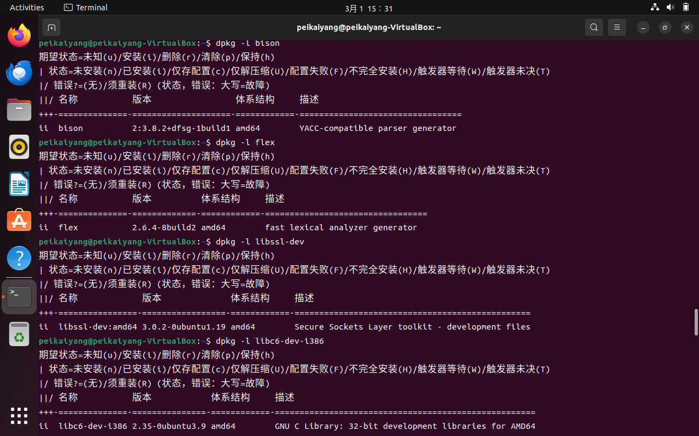

&nbsp;

<style>
  .custom-hr {
    text-align: center;
    border-top: 1px solid #333;
    line-height: 0.1em;
    margin: 10px 0;
  }
  .custom-hr span {
    background: #fff;
    padding: 0 10px;
  }
</style>

<div class="custom-hr">
  <span>实验任务二</span>
</div>

- **任务要求**

  - 下载Linux内核
  - 将内核编译成`i386 32位`版本，检查Linux压缩镜像和符号表是否生成

- **实验步骤**

  - 下载`Linux 5.10.234`内核压缩包到文件夹`lab1`中

  - 解压内核压缩包，并进入内核文件中
    ```
    xz -d linux-5.10.234.tar.xz
    tar -xvf linux-5.10.234.tar
    cd linux-5.10.234
    ```

  - 生成`i386`默认配置文件，并在文本界面调整内核配置
  
    ```
    make i386_defconfig
    make menuconfig
    ```

  - 并行编译`Linux`内核

    ```
    make -j8
    ```

  - 检查`Linux`内核是否编译成功
    
    - 查看`Linux`压缩镜像
    
      ```
      ls linux-5.10.234/arch/x86/boot/bzImage
      ```
    

    - 查看`Linux`符号表

      ```
      ls linux-5.10.234/vmlinux
      ```

- **实验结果**

  - 内核手动配置
  
  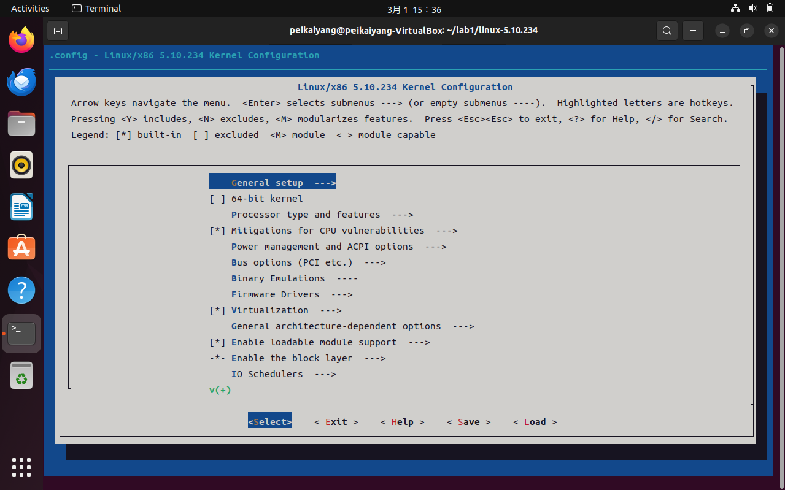
  
  - 并行编译内核
  
  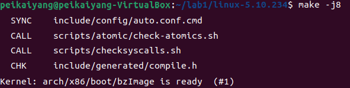
  
  - `Linux`编译结果

  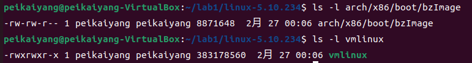

&nbsp;

<style>
  .custom-hr {
    text-align: center;
    border-top: 1px solid #333;
    line-height: 0.1em;
    margin: 10px 0;
  }
  .custom-hr span {
    background: #fff;
    padding: 0 10px;
  }
</style>

<div class="custom-hr">
  <span>实验任务三</span>
</div>

- **任务要求**

  - 使用`qemu`启动内核
  - 使用`gdb`远程调试内核运行

- **实验步骤**

  - 使用`qemu`运行`Linux`内核镜像，并等待`gdb`连接后再继续运行
  
    ```
    qemu-system-i386 -kernel linux-5.10.19/arch/x86/boot/bzImage -s -S -append "console=ttyS0" -nographic
    ```

  - 在另一个终端启动`gdb`
  
    ```
    gdb
    ```
  
  - 进入`Linux`文件，在`gdb`下加载符号表
  
    ```
    cd linux-5.10.234
    file linux-5.10.234/vmlinux
    ```
  
  - 在`gdb`中连接到`qemu`
  
    ```
    target remote:1234
    ```
  
  - 在`gdb`中为`start_kernel`设置断点
  
    ```
    break start_kernel
    ```
  
  - 在`gdb`中让调试程序继续运行
  
    ```
    c
    ```

- **实验结果**

  &nbsp;&nbsp;&nbsp;&nbsp;&nbsp;&nbsp;&nbsp;`Linux`系统能够成功运行，但是最终以`Kernel Panic`结束。在终端输出的`Call Trace`指明了是在`initrd_load`阶段出错。因为在启动系统的时候，只指定了`bzImage`内核，但没有提供`initrd`文件，也没有`initramfs`文件系统，因此导致启动失败。

  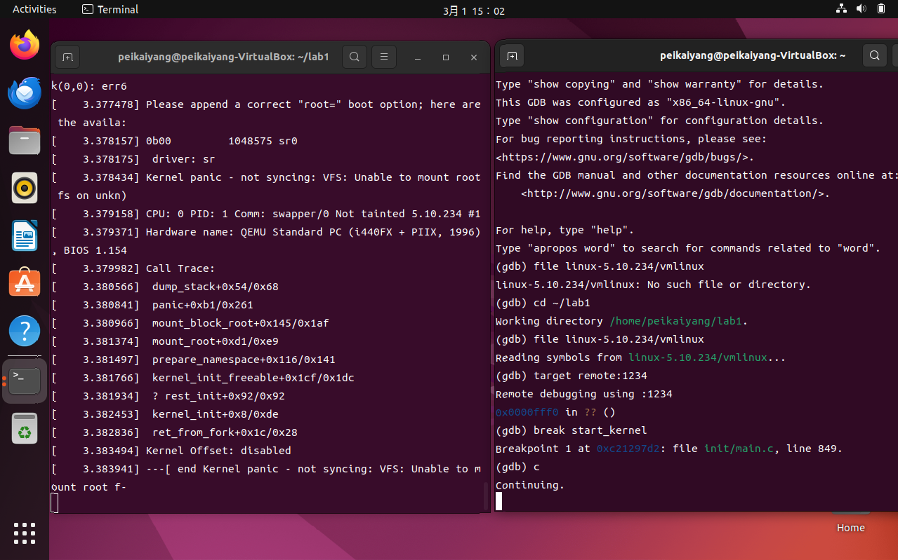

&nbsp;

<style>
  .custom-hr {
    text-align: center;
    border-top: 1px solid #333;
    line-height: 0.1em;
    margin: 10px 0;
  }
  .custom-hr span {
    background: #fff;
    padding: 0 10px;
  }
</style>

<div class="custom-hr">
  <span>实验任务四</span>
</div>

- **任务要求**

  - 编写简单的C语言程序制作`initramfs`
  - 加载`initramfs`，使用`gdb`调试

- **实验步骤**
  
  - 编写C语言程序
    
    - 使用`nano`编辑器创建`helloworld.c`文件
    
      ```
      nano helloworld.c
      ```
    
    - 在`helloworld.c`中写入一个简单程序

      ```
      #include <stdio.h>

      void main()
      {
          printf("lab1: Hello World\n");
          fflush(stdout);
          while(1);
      }
      ```
    
  - 编译上述C语言程序
    
    ```
    gcc -o helloworld -m32 -static helloworld.c
    ```
    
  - 用`cpio`打包`initramfs`得到`hwinitramfs`
    
    ```
    echo helloworld | cpio -o --format=newc > hwinitramfs
    ```
    
  - 启动内核，并加载`initramfs`
  
    ```
    qemu-system-i386 -kernel linux-5.10.19/arch/x86/boot/bzImage -initrd hwinitramfs -s -S -append "console=ttyS0 rdinit=helloworld" -nographic
    ```
    
  - 重复任务三中`gdb`调试步骤
&nbsp;

- **实验结果**

  - 编写及编译C语言程序结果
  
  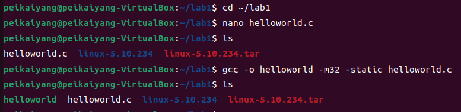

  - `initramfs`的制作结果
  
  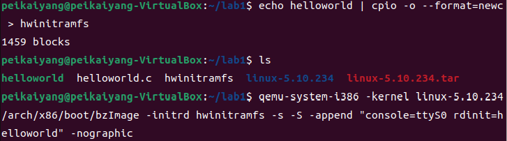

  - `initramfs`的`gdb`调试结果

  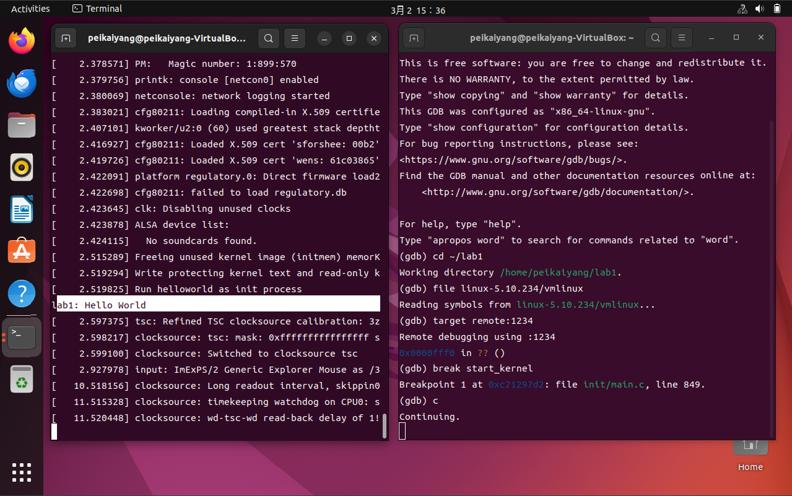

&nbsp;

<style>
  .custom-hr {
    text-align: center;
    border-top: 1px solid #333;
    line-height: 0.1em;
    margin: 10px 0;
  }
  .custom-hr span {
    background: #fff;
    padding: 0 10px;
  }
</style>

<div class="custom-hr">
  <span>实验任务五</span>
</div>

- **任务要求**
  
  - 下载并解压`Busybox`
  - 编译`Busybox`
  - 制作`Initramfs`
  - 加载`Busybox`

- **实验步骤**

  - 在课程指定网站下载`Busybox`到`lab1`文件夹，并解压
  
    ```
    wget -P /home/peikaiyang/lab1/ http://172.18.167.174:7991/course/18/ware/383/download
    mv download Busybox
    tar -xjf Busybox
    ```

  - 编译`Busybox`(具体操作同任务二)
  
    ```
    make defconfig
    make menuconfig
    
    make -j8
    make install
    ```
  
  - 制作`Initramfs`
  
    - 将安装在_install目录下的文件和目录取出放在`~/lab1/mybusybox`
    
      ```
      cd ~/lab1
      mkdir mybusybox
      mkdir -pv mybusybox/{bin,sbin,etc,proc,sys,usr/{bin,sbin}}
      cp -av busybox-1.33.0/_install/* mybusybox/
      cd mybusybox
      ```
    
    - 编写`init`程序
    
      - 用`gedit`打开`init`
        
        ```
        gedit init
        ```
    
      - 写一个简单的`shell`脚本作为`init`

        ```
        #!/bin/sh
        mount -t proc none /proc
        mount -t sysfs none /sys
        echo -e "\nBoot took $(cut -d' ' -f1 /proc/uptime) seconds\n"
        exec /bin/sh
        ```

    - 加上执行权限
    
      ```
      chmod u+x init
      ```
    
    - 将上述内容打包归档成`cpio`文件
  
      ```
      find . -print0 | cpio --null -ov --format=newc | gzip -9 > ~/lab1/initramfs-busybox-x86.cpio.gz
      ```
  - 加载`Busybox`，并查看当前文件夹

    ```
    cd ~/lab1
    qemu-system-i386 -kernel linux-5.10.19/arch/x86/boot/bzImage -initrd initramfs-busybox-x86.cpio.gz -nographic -append "console=ttyS0" -m size=2048
    ls
    ```

- **实验结果**

  - 当前文件夹内容
  
  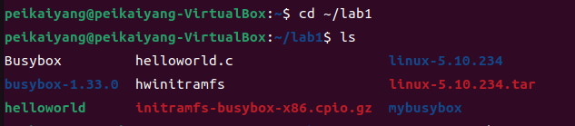
  
  - `Busybox`运行结果

  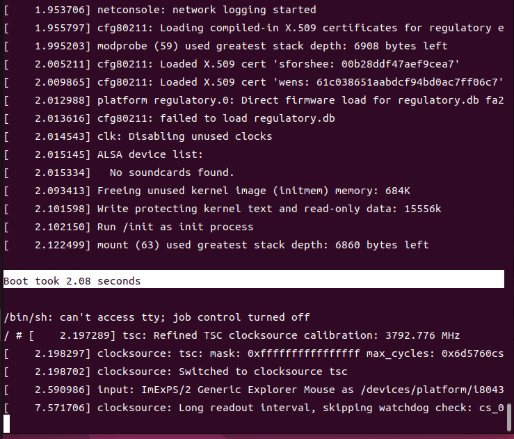

&nbsp;

<style>
  .custom-hr {
    text-align: center;
    border-top: 1px solid #333;
    line-height: 0.1em;
    margin: 10px 0;
  }
  .custom-hr span {
    background: #fff;
    padding: 0 10px;
  }
</style>

<div class="custom-hr">
  <span>实验任务六</span>
</div>

- **任务要求**
  
  - 下载`Linux 0.11`内核代码
  - 编译32位版本的`Linux 0.11`内核
  - 使用`qemu-system-i386`加载、启动内核
  - 利用`gdb`进行远程调试
  - 创建本地挂载目录，并在目录内创建文件

- **实验步骤**
  
  - 把`Linux 0.11`内核代码压缩包从主机传输到虚拟机中
    
    - 按照`[3]`中共享文件夹的说明，配置好文件传输环境，把压缩包通过`Shared`文件夹移动到`lab1`文件夹中
  
  - 解压内核压缩包，并进入`Linux-0.11`文件
  
    ```
    tar -xvzf Linux-0.11-lab1.tar.gz
    cd Linux-0.11
    ```

  - 查看`Makefile`，找到`CFLAGS`变量，添加`-g`、`-m32`参数
  
    ```
    nano Makefile
    ```
  
  - 编译32位版本的`Linux-0.11`内核
  
    ```
    make -j8
    ```

  - 使用`qemu-system-i386`加载启动内核
  
    ```
    qemu-system-i386 -m 16 -boot a -fda Image -hda hdc-0.11.img -s -S
    ```
  
  - 利用`gdb`进行远程调试
  
    - 在另一终端启动`gdb`，加载`Linux-0.11`符号表
    
      ```
      gdb
      cd ~/lab1/Linux-0.11
      (gdb)symbol-file tools/system
      ```
    
    - 远程连接`qemu`调试
    
      ```
      (gdb)target remote :1234
      ```
    
    - 设置源码目录
    
      ```
      (gdb)directory /home/peikaiyang/lab1/Linux-0.11
      ```
    
    - 设置汇编代码的形式
    
      ```
      (gdb)set disassembly-flavor intel
      ```
      
    - 在关键位置设置断点(应到加载系统起始地址，内核入口函数),并继续执行
    
      ```
      (gdb)break *0x7c00
      (gdb)break main
      (gdb)continue
      ```
    
    - 观察`0x7DFE`和`0x7DFF`地址存储的内容
  
      ```
      (gdb)x/2x 0x7DFE
      ```
  
  - 创建本地挂载目录`hdc`
  
    - 查看磁盘的分区情况
      
      ```
      cd ~/lab1/Linux-0.11
      fdisk -l hdc-0.11.img
      ```
  
    - 创建本地挂载目录
    
      ```
      mkdir hdc
      ```
    
    - 显示磁盘空间
    
      ```
      df -h
      ```
    
    - 挂载`Linux-0.11`硬盘镜像
    
      ```
      sudo mount -t minix -o loop,offset=512 /home/peikaiyang/lab1/Linux-0.11/hdc-0.11.img hdc
      ```
    
    - 查看是否挂载成功
    
      ```
      df -h
      ```
    
    - 查看挂载后的`hdc`目录
      
      ```
      ll hdc
      ```

  - 在目录中创建文件`hello.txt`

    - 进入`hdc`的`usr`目录
    
      ```
      cd hdc/usr
      sudo touch hello.txt
      sudo nano hello.txt
      ```
    
    - 卸载文件系统`hdc`
    
      ```
      cd ../..
      sudo umount /dev/loop16
      df -h
      ```
    
    - 重启`Linux-0.11`，观察`/usr`目录在是否还有`hello.txt`文件
    
      ```
      qemu-system-i386 -m 16 -boot a -fda Image -hda hdc-0.11.img
      ls /usr/hello.txt
      ```
  
- **实验结果**

  - 编译`Linux-0.11`内核结果
  
  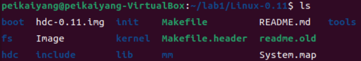
  
  - 使用`qemu-system-i386`启动结果
  
  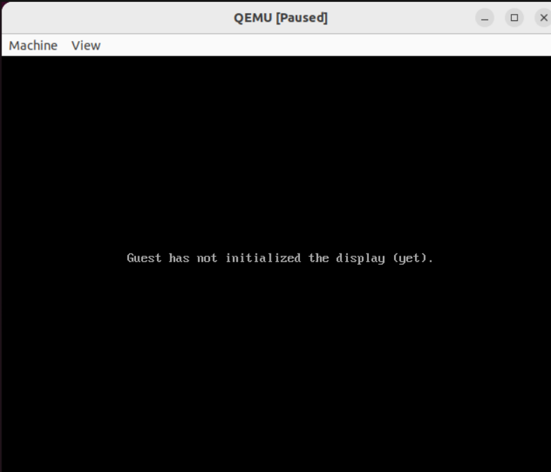
  
  - `gdb`调试过程及结果
  
  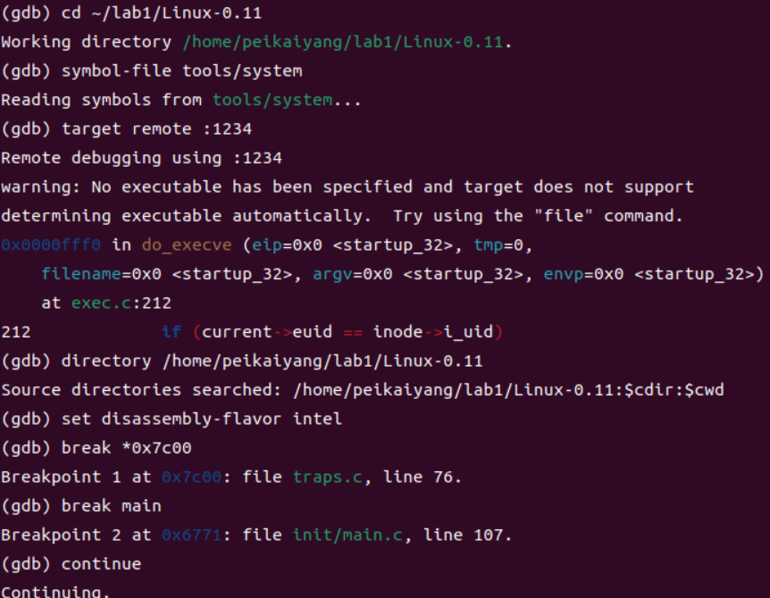
  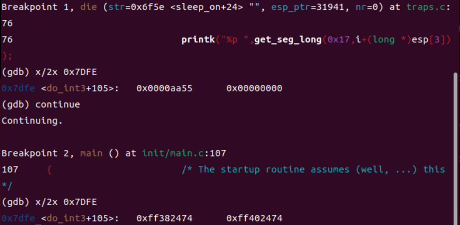

  - `Linux-0.11`硬盘镜像挂载结果
  
  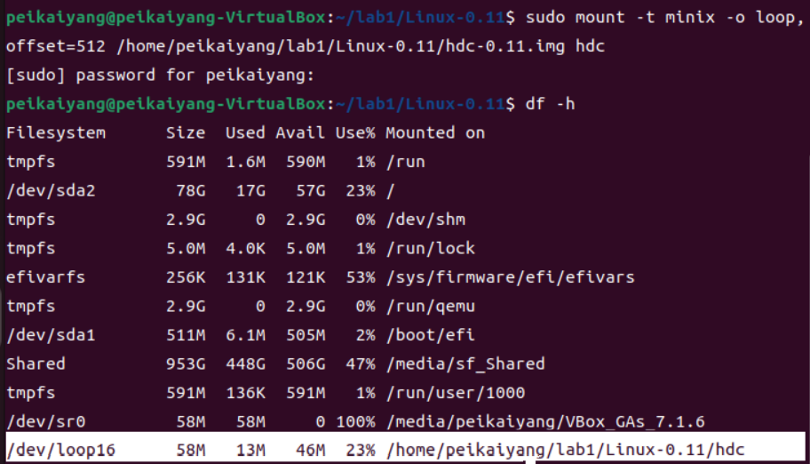
  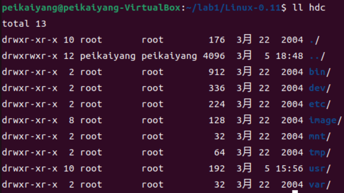
    
  - `hdc`卸载后`hello.txt`观察结果
  
  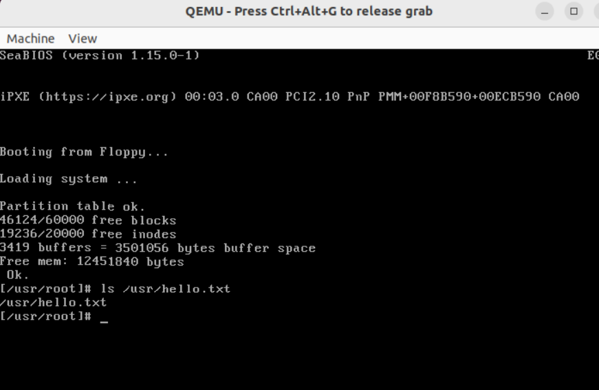
&nbsp;
### Section 3 实验总结与心得体会

  - 第一次使用虚拟机，加上不熟悉各种命令行命令，在配置环境这一步花费了很多时间。在`Virtualbox`中安装`Ubuntu`系统时，我试了很多次都不行。我把`Virtualbox`删了重下，把`Ubuntu ISO`文件删了，换清华源，都没成功。在询问了`deepseek`后，我才知道不需要在主机打开`Ubuntu ISO`文件，只需要直接在虚拟机中加载`Ubuntu ISO`文件就行了。
  
  - 而实验任务二到实验任务五在详细的操作文档的指导下，都比较顺利地完成了。
  
  - 在完成实验任务六的时候，碰到了较大的阻力，有四个步骤卡地比较久。第一个步骤是在传递`Linux`内核文件的时候，我试了两个方法：(1)直接把文件拖拽到虚拟机中、(2)尝试去`Linux`官网重新下载0.11版本的内核，但都失败了，翻了往年的实验指导文档，发现往年都没有任务六，因此搁置了一段时间，机缘巧合之下，在`CSDN`中发现了虚拟机的共享文件夹，才得以解决这个问题。第二个步骤是在编译`Linux`内核的时候，不知道该怎么添加`-g` `-m32`参数，询问了张皓昱同学和周宏杰同学之后，才知道要去`Makefile`中修改。第三个步骤是在用`fdisk`命令查看磁盘情况时，在终端中输入`fdisk hdc-0.11.img`总是没有显示正确的结果，然后是在问了`deepseek`后，才知道正确的命令是`fdisk -l hdc-0.11.img`。第四个步骤是在卸载文件系统`hdc`时，终端总是显示`target is busy`，我不知道这是什么意思，在询问了`deepseek`后，我才知道因为当前文件正在运行，所以无法删除，需要先退出当前文件夹，才能顺利卸载。
  - 第一次接触操作系统的实验，由于缺乏命令行、`Makefile`、虚拟机、操作系统等知识，感觉还是比较难的，用了差不多一个星期才完成全部实验任务。还是得尽快熟悉相关知识，希望在以后的操作系统实验中能够更顺利地完成实验。
&nbsp;
### Section 4 对实验的改进建议和意见

  - 实验任务六：需要把 `Linux 0.11`内核压缩包从主机传输到虚拟机中，这里涉及共享文件夹的使用。希望能够补充 共享文件夹 的使用说明。
  
  - 实验任务六：查看磁盘分区情况的命令`fdisk hdc-0.11.img`有误，应是`fdisk -l hdc-0.11.img`。
  
  - 实验任务六：在卸载文件系统`hdc`时，直接输入命令`sudo umount /dev/loop16`，终端会提示`target is busy`，无法卸载。因此要先在上述命令输入前输入`cd ../..`退出当前文件夹。
&nbsp;
### Section 5 参考资料清单

  [1] 课程实验文档：https://gitee.com/apshuang/sysu-2025-spring-operating-system/tree/master/lab1#%E7%BC%96%E8%AF%91linux%E5%86%85%E6%A0%B8

  [2] 在`Ubuntu`使用命令行下载网站内容说明：https://www.oryoy.com/news/ru-he-zai-ubuntu-zhong-shi-yong-ming-ling-xing-xia-zai-wang-zhan-nei-rong-wget-yu-curl-ji-qiao-xiang.html

  [3] `Virtualbox`共享文件夹使用说明：https://blog.csdn.net/danshiming/article/details/117997558