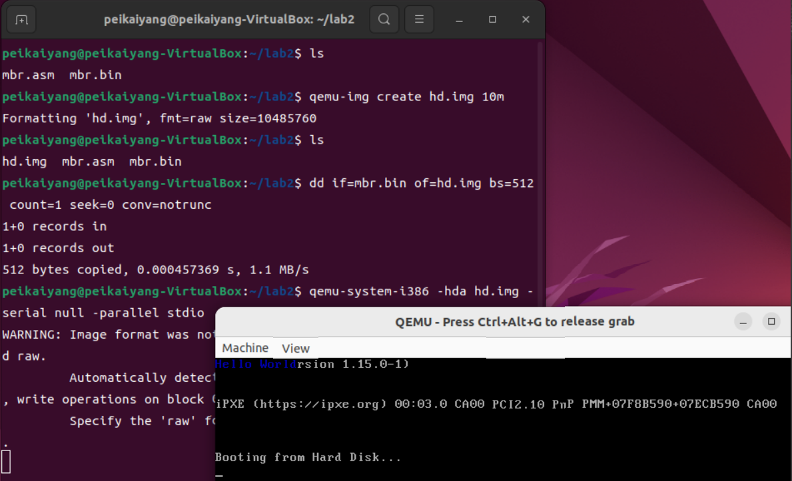
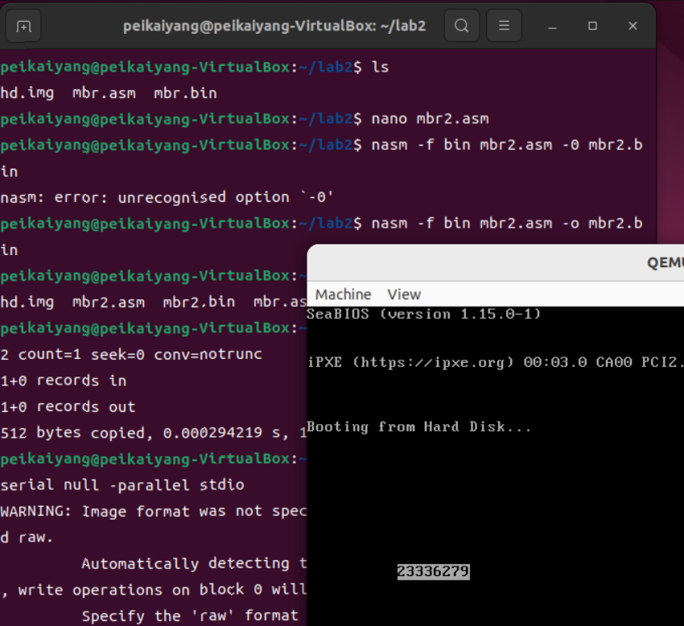
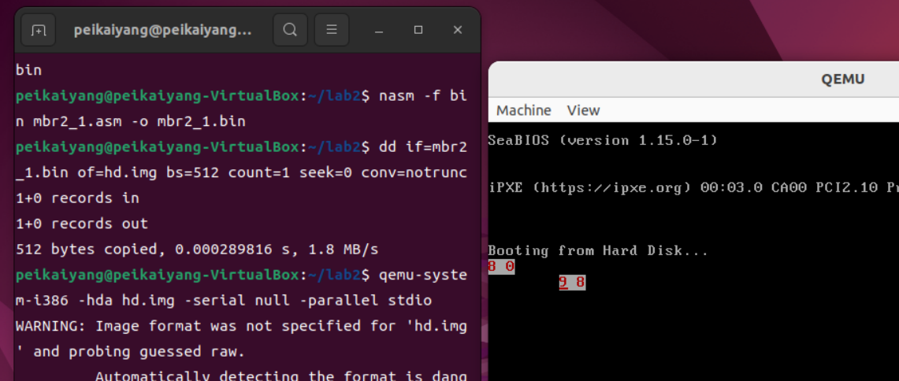
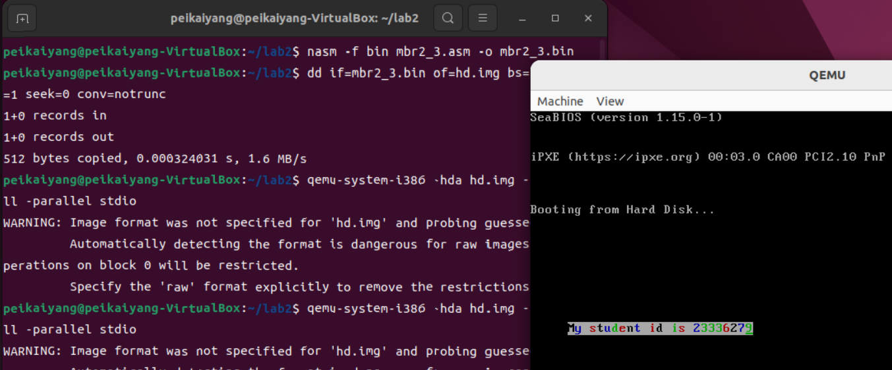
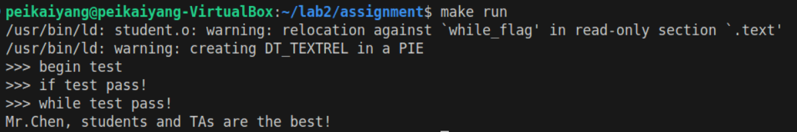
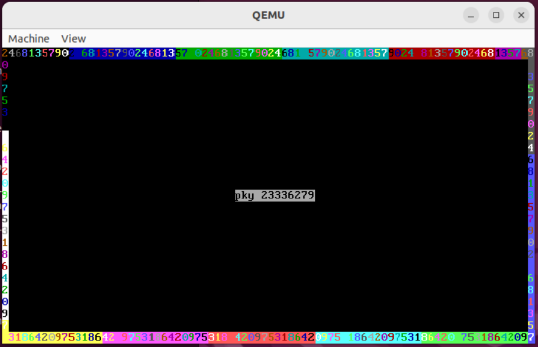

### Section1 实验概述

- **实验任务一**：复现 `example 1`,并修改 `MBR`代码，在(16，10)开始输出学号
- **实验任务二**：在实模式下，利用光标中断实现光标位置获取、光标移动，并利用光标中断实现学号输出，利用键盘中断实现键盘输入并回显
- **实验任务三**：使用汇编语言实现分支逻辑、循环逻辑和函数，并编译运行
- **实验任务四**：使用汇编代码实现字符回旋程序

### Section 2 实验步骤与实验结果

<style>
  .custom-hr {
    text-align: center;
    border-top: 1px solid #333;
    line-height: 0.1em;
    margin: 10px 0;
  }
  .custom-hr span {
    background: #fff;
    padding: 0 10px;
  }
</style>

<div class="custom-hr">
  <span>实验任务一</span>
</div>

- **任务要求**

  - 复现 `example 1`，在 `qemu`显示屏(0,0)处开始输出 `Hello world`
  - 修改 `example 1`的代码，在qemu显示屏(16,10)处开始显示学号 `23336279`
- **思路分析**

  - **任务 1.1**

    - 把实验文档中的 `MBR`代码复制到 `mbr1_1.asm`中，按照后续实验步骤操作即可
  - **任务 1.2**

    - 任务1.2主要是在任务1.1的代码基础上，修改 *起始位置*、*前景色和背景色*、*输出内容*，得到新的 `MBR`文件 `mbr1_2.asm`
    - **修改起始位置**：根据显存位置公式 `pos = 2 * (80 * x + y)`可得，矩阵映射到的显存地址为 `2 * (80 * 16 + 10 + i)`，其中 `i`表示要输出的字符在整个字符串中的具体位置
    - **修改前景色和背景色**：由于前景色和背景色由 `ah`中的数值决定，故作如下修改 `mov ah, 0x01 ; 黑底蓝字` `->` `mov ah 0x70 ; 白底黑字`
    - **修改输出内容**：把每次放到 `al`中的字符，由 `Hello world`修改为 `23336279`
    - 再按照实验步骤操作即可
- **实验步骤**

  - 编写汇编代码文件 `mbr.asm`

    ```shell
    nano mbr.asm
    ```
  - 使用 `nasm`汇编器将汇编代码编译成二进制代码

    ```shell
    nasm -f bin mbr.asm -o mbr.bin
    ```
  - 创建一个虚拟硬盘 `hd.img`

    ```shell
    qemu-img create hd.img 10m
    ```
  - 把 `MBR`文件写入虚拟硬盘的首扇区

    ```shell
    dd if=mbr.bin of= hd.img bs=512 count=1 seek=0 conv=notrunc
    ```
  - 启动 `qemu`来模拟计算机启动

    ```shell
    qemu-system-i386 -hda hd.img -serial null -parallel stdio
    ```
- **实验结果**

  - **任务1.1**

    
  - **任务1.2**

    

<style>
  .custom-hr {
    text-align: center;
    border-top: 1px solid #333;
    line-height: 0.1em;
    margin: 10px 0;
  }
  .custom-hr span {
    background: #fff;
    padding: 0 10px;
  }
</style>

<div class="custom-hr">
  <span>实验任务二</span>
</div>

- **任务要求**

  - 在实模式下，利用光标中断获取光标位置并移动光标到指定位置
  - 在实模式下，利用光标中断输出学号
  - 在实模式下，利用键盘中断实现键盘输入并回显
- **思路分析**

  - **任务2.1**

    - 为了让实验结果更清晰，分别在 *光标移动前* 和 *光标移动后* 显示了光标位置(按照 左行右列 的形式显示)
    - **第一次显示光标位置**：先使用如下中断指令获取光标位置(`mov ah, 03h`、`mov bx, 0`、`int 10h`)，由于获得的光标位置是用行列来表示的(`DH = 行` `DL = 列`)，故可以按照任务一中的显示方法，把光标位置输出到 `qemu`显示屏中
    - **移动光标**：使用中断指令移动光标位置到(9,8)(`mov ah, 02h`、`mov bh, 0`、`mov dh, 9`、`mov dl, 8`、`int 10h`)
    - **第二次显示光标位置**：和 第一次显示光标位置 思路相同
  - **任务2.2**

    - 主要使用 *光标移动* 和 *在当前光标处输出字符* 两个中断指令
    - 按照任务1.2的要求，先使用光标移动的中断指令把光标置于(16,10)，具体思路同任务2.1中 移动光标 这一步骤
    - 接下来重复这两个步骤：(1)输出字符、(2)光标前移一位，直到所有字符输出完毕为止(由于我的学号中有三个相同的数字连在一起，我选择一次性输出这三个数字，因此这个时候光标需要向前移动三位)

      ```nasm
      ;输出 2
      mov ah, 09h
      mov al, '2'
      mov bh, 0
      mov bl, 70h 
      mov cx, 1
      int 10h

      ;把光标向前移动1位
      mov ah, 02h
      mov bh, 0
      mov dh, 16
      mov dl, 11
      int 10h
      ```
  - **任务2.3**

    - 主要使用 *键盘输入*、*光标移动*、*在当前光标输出字符* 这三个指令
    - 为了让实验结果更明显，从(16,5)开始输出字符串 `My student id is 23336279`，并且在字符串输出过程中，背景色始终保持为白色，前景色按照黑色、蓝色、绿色、红色的顺序循环(即八位寄存器 `ah`中的内容按照 `70h`、`71h`、`72h`、`74h`的顺序变化)
    - 接下来重复25次以下三个步骤：(1)键盘中断，从键盘读入一个字符(`mov ah, 0`、`int 16h`)、(2)在当前光标位置处输出读入的字符、(3)光标向前移动一位(由于我的学号中有三个相同的数字连在一起，我选择一次性输出这三个数字，因此这个时候光标需要向前移动三位)

      ```nasm
      ;键盘中断，从键盘读入 'M'
      mov ah, 0
      int 16h

      ;在当前光标位置输出 'M'
      mov ah, 09h
      mov bh, 0
      mov bl, 70h
      mov cx, 1
      int 10h

      ;光标向前移动1位
      mov ah, 02h
      mov dl, 6
      int 10h

      ```
- **实验步骤**

  - 实验步骤完全与任务一相同
- **实验结果**

  - **任务2.1**

    
  - **任务2.2**

    
  - **任务2.3**

    

<style>
  .custom-hr {
    text-align: center;
    border-top: 1px solid #333;
    line-height: 0.1em;
    margin: 10px 0;
  }
  .custom-hr span {
    background: #fff;
    padding: 0 10px;
  }
</style>

<div class="custom-hr">
  <span>实验任务三</span>
</div>

- **任务要求**

  - 把 分支逻辑、循环逻辑、某个函数 的伪代码 改写成 汇编代码，并测试
- **思路分析**

  - **分支逻辑**：有三个分支：`al >= 40`、`a1 >= 18 && a1 < 40`、`a1 < 18`。

    - `a1 >= 40`：跳转到标签 `label_greater_40`所在位置，执行 `if_flag = (a1 + 3) / 5`对应的汇编代码
    - `a1 >= 18 && a1 < 40`：跳转到标签 `label_greater_18`所在位置，执行 `if_flag = 80 - (a1 * 2)`对应的汇编代码
    - `a1 < 18`：跳转到标签 `label_else`所在位置，执行 `if_flag = a1 << 5`对应的汇编代码

    ```nasm
    ;分支语句
    ;由于在cpp文件中，已经声明 a1 是int类型的了，因此，不需考虑 a1 为浮点数的情况
    mov eax, [a1]

    ;与40比较，若>=40，则跳转到 label_greater_40
    cmp eax, 40
    jge label_greater_40

    ;与18比较，若>=18，ls则跳转到 label_greater_18
    cmp eax, 18
    jge label_greater_18

    ;若<18，则跳转到 label_else
    label_else:  
        shl eax, 5
        mov dword [if_flag], eax ;注意要加上 []
        jmp exit_label1

    label_greater_18:  
        mov ebx, 2
        imul ebx, eax
        mov eax, 80
        sub eax, ebx
        mov dword [if_flag], eax ;注意要加上 []
        jmp exit_label1

    label_greater_40:
        add eax, 3
        mov ebx, 5
        mov edx, 0
        idiv ebx
        mov dword [if_flag], eax ;注意要加上 []
        jmp exit_label1

    exit_label1:
    ```
  - **循环逻辑**：`a2`初值为0，不断自增。当 `a2 >= 25`时，跳出循环体，否则一直重复执行以下三个操作：(1) `my_random`函数调用、(2)把随机生成的字符放入数组偶数下标对应的地址中、(3)`a2`自增。

    ```nasm
    ;循环语句
    Loop1:
        cmp dword [a2], 25
        jge exit_label2

        call my_random
        mov edx, 0
        imul edx, [a2], 2
        add edx, [while_flag]
        mov byte [edx], al
        inc dword [a2]

        jmp Loop1

    exit_label2:
    ```
  - **函数**：使用循环 遍历 `your_string`字符数组，直到字符数组末尾'\0'。循环过程中，重复执行以下5个操作：(1)`pushad`、(2)把字符数组中一个字符对应的二进制数加9的结果入栈、(3)调用函数 `print_a_char`在终端按顺序输出字符数组中的一个字符、(4)栈顶出栈、(5)`popad`

    ```nasm
    ;函数
    xor eax, eax ; eax 清零，用作数组下标
    mov ebx, [your_string]
    Loop2:
        cmp byte [ebx + eax], 0
        je exit_label3

        pushad
        mov bl, byte [ebx + eax]
        add bl, 9
        mov bh, 0
        push bx
        call print_a_char
        pop bx
        popad

        inc eax

        jmp Loop2

    exit_label3:
        ret
    ```
- **实验步骤**

  - 安装相应的环境

    ```shell
    sudo apt install gcc-multilib g++-multilib
    ```
  - 编写汇编代码文件

    ```shell
    nano student.asm
    ```
  - 测试写好的汇编代码

    ```shell
    make run
    ```
- **实验结果**

  *在 `test.cpp`中把 `a1`改成41、25、10、0.7，都显示同一个结果，故不重复放置运行截图*

  

<style>
  .custom-hr {
    text-align: center;
    border-top: 1px solid #333;
    line-height: 0.1em;
    margin: 10px 0;
  }
  .custom-hr span {
    background: #fff;
    padding: 0 10px;
  }
</style>

<div class="custom-hr">
  <span>实验任务四</span>
</div>

- **任务要求**

  - 使用汇编代码实现一个字符回旋程序
- **思路分析**

  - 屏幕显示可以分成两部分：(1)在屏幕中央显示个人信息 `pky 23336279`，(2)沿 `qemu`显示屏边缘输出字符。
  - **输出个人信息**

    - 先使用 *清屏中断* 清空屏幕(`mov ax, 0003h`，`int 10h`)
    - 使用 *光标移动中断* 把光标移动到(12,35)，然后按照任务2的步骤在屏幕输出 `pky 233362679`
  - **在屏幕边缘输出字符**

    - 循环输出主要是通过在各标签之间跳转实现的

      ```UML
      Loop_above -> Loop_right
          ↑             ↓
      Loop_left  <- Loop_below
      ```
    - 有一些寄存器的值不常改变，可以提前统一设置

      ```nasm
      mov bx, 0 ; 页码始终为0，字符初始颜色设为 黑色 (00h)
      mov dx, 0 ; 字符从(0,0)开始输出
      mov cx, 1 ; 每次输出的字符个数为1
      mov al, '0' ; 输出的第一个字符设为0
      ```
    - 在主体程序中，有两个函数被广泛用到，先提前给出：

      - `Change_char`

        ```nasm
        ;修改 字符内容
        Change_char:
            cmp al, '8'
            je Change_to_1

            cmp al, '9'
            je Change_to_0

            add al, 2
            jmp exit_label

        Change_to_1:
            mov al, '1'
            jmp exit_label

        Change_to_0:
            mov al, '0'
            jmp exit_label
        exit_label:
            ret   
        ```
      - `Slow_down`

        ```nasm
        ;减慢字符输出速度
        Slow_down:
            mov esi, 0

        LOOP:
            cmp esi,8000000
            je LOOP_END
            inc esi
            jmp LOOP
        LOOP_END:
            ret
        ```
    - **在上边缘 自左向右 输出字符**：

      - 保持 `dh = 0`，`dl`从0遍历到79。当 `dl`变为79时，跳转到 `Loop_right`,在右边缘继续输出字符
      - 调用函数 `Change_char`修改输出的字符
      - 使用光标中断输出当前字符，并把光标向右移动一位
      - 控制背景色和前景色变化
      - 调用函数 `Slow_down`控制字符输出速度
      - 跳转到循环体开头，重复上述过程

    ```nasm
    ;在屏幕上边缘 自左向右 输出字符
    Loop_above:
        ;判断是否达到最右侧
        cmp dl, 79
        je Loop_right

        ;修改 字符内容
        call Change_char

        ;输出 字符
        mov ah, 09h
        int 10h

        ;把光标向右移动1位
        mov ah, 02h
        inc dl
        int 10h

        ;控制背景色和前景色的改变
        inc bl

        ;控制字符输出速度
        call Slow_down

        jmp Loop_above
    ```

    - **在右边缘 自上向下 输出字符**：

      - 保持 `dl = 79`不变，`dh`从0遍历到24。当 `dh`变为24时，跳转到 `Loop_below`，在下边缘继续输出字符
      - 其余操作同上

    ```nasm
    ;在屏幕右边缘  自上向下  输出字符
    Loop_right:
        ;判断是否达到最下面
        cmp dh, 24
        je Loop_below

        ;修改 字符内容
        call Change_char

        ;输出 字符
        mov ah, 09h
        int 10h

        ;把光标向下移动1位
        mov ah, 02h
        inc dh
        int 10h

        ;控制背景色和前景色的改变
        inc bl

        ;控制字符输出速度
        call Slow_down

        jmp Loop_right
    ```

    - **在下边缘 自右向左 输出字符**：

      - 保持 `dh = 24`不变，`dl`从79遍历到0。当 `dl`变为0时，跳转到 `Loop_left`，在左边缘继续输出字符
      - 其余操作同上

    ```nasm
    ;在屏幕下边缘  自右向左  输出字符
    Loop_below:  
        ;判断是否达到最左侧
        cmp dl, 0
        je Loop_left

        ;修改 字符内容
        call Change_char

        ;输出 字符
        mov ah, 09h
        int 10h

        ;把光标向左移动1位
        mov ah, 02h
        dec dl
        int 10h

        ;控制背景色和前景色的改变
        inc bl

        ;控制字符输出速度
        call Slow_down

        jmp Loop_below
    ```

    - **在左边缘 自下向上 输出字符**：

      - 保持 `dl = 0`不变，`dh`从24遍历到0。当 `dh`变为0时，跳转到 `Loop_above`，在上边缘继续输出字符
      - 其余操作同上

    ```nasm
    ;在屏幕左边缘  自下向上 输出字符  
    Loop_left:  
        ;判断是否达到最上面
        cmp dh, 0
        je Loop_above

        ;修改 字符内容
        call Change_char

        ;输出 字符
        mov ah, 09h
        int 10h

        ;把光标向上移动1位
        mov ah, 02h
        dec dh
        int 10h

        ;控制背景色和前景色的改变
        inc bl

        ;控制字符输出速度
        call Slow_down

        jmp Loop_left
    ```
- **实验步骤**

  - 实验步骤同任务1
- **实验结果**

  

### Section 3 实验总结与心得体会

- **任务2.1**

  - 在任务2.1第一版的汇编代码中，我在计算字符输出在显示屏的位置时，使用的是 `mov [gs:bl], ax`，但是终端报错：这不是有效地址。在询问了deepseek后，得知必须使用十六位寄存器，所以改成 `mov [gs:bx], ax`
  - 在任务2.1第二版的汇编代码中，由于获取光标位置的行列信息是分别储存在 `dh`、`dl`中，因此 `mov bx, dh`和 `mov cx, dl`这两行代码报错：寄存器数位不一致。在询问了deepseek后，改成了 `movzx bx, dh`、`mov cx, dl`
  - 在任务2.1的第三版汇编代码中，终端没有报错，但是显示的结果始终是乱码。在询问了deepseek后，得知 `dh`、`dl`中储存的数据是二进制数据，如果放到 `al`中直接输出的话，就会显示乱码，需要先把 `dh`、`dl`中的数据转换成 `ASCII码`才能正确输出，因此在 `mov [gs:bx], ax`这条指令之前，加了一条指令 `add al, '0'`
- **任务2.2**

  - 在任务2.2的第一版汇编代码中，由于在每次输出一个字符后，没有把光标向前移动一位，因此导致所有字符都在同一个位置输出，最后呈现出来的结果就是，只有最后一个输出的字符在显示屏中显示。因此，在每个中断输出指令后面，紧跟一条 光标向前移动一位 的指令。
- **任务2.3**

  - 在任务2.3的汇编代码中，有25个相同的结构，占据了很大篇幅，我刚开始以为，编译之后，二进制文件会超出512个字节，而无法放进虚拟硬盘的首个扇区，但是运行之后，很幸运地发现，没有超，可以正常运行。
- **任务3**

  - 在任务3的循环逻辑部分，`a2`的值要及时更新，不能单纯作为循环条件自增变量的初始值。因为在 `test,.cpp`，`random_buffer`的构造也用到了 `a2`，如果不更新 `a2`的值，那么 `random_buffer`就只有第一个字符非空，必然导致 `while_test`无法通过。如果不更新 `a2`的值，则会导致*段错误* `Segmentation fault`
  - 在任务3的函数部分，是把 `your_string[i] + 9`的结果放入栈中，而不是把 `your_string[i] += 9`的结果放入栈中。因为在 `test.cpp`中，定义 `your_string`为 `const`,如果按照第二种写法，就会导致 *段错误* `Segmentation fault`
  - 内存的地址，不能放入 `[]`中计算，比如：`mov byte [[while_flag] + [a2] * 2]`就是不合法的。必须提前使用寄存器计算好。
  - 虽然有一些 链接重定位 的问题，但是不影响得到正确结果，故暂时搁置。
  - 在任务3的 `段错误`卡了很久，一直没法解决。多亏了助教的细心引导，我才得以成功运行。我觉得我没有自己解决这个问题主要有两个原因：一方面是因为没有认真阅读cpp代码，没有搞清楚是怎样更新 `while_flag`数组的内容(我一直以为是把 `eax`放入数组中，然后每一次都会有两个字节的内容被覆盖。但实际上，是把 `al`放入下标为偶数的数组地址中。如果采用第一次中理解的话，会在数组末尾访问没分配的空间，也就会导致 `段错误`)；另一方面是因为不熟悉汇编语法，有很多都和C/C++的语法杂糅在一起了(比如：`mov byte [[while_flag] + [a2] * 2]`，这种不合理的内存地址计算方法也会导致 `段错误`)，然后自己检查又觉得很合理，认为没有错误，因此就导致了长时间没有解决。
  - 特别感谢助教的耐心引导，让我认识到错误所在。
- **任务4**

  - 任务4的必做题相对而言比较简单，没有很纠结的地方。
  - 感谢周宏杰同学告知可以使用清屏指令 `mov ax, 0003h` `int 10h`来清空 `qemu`屏幕

### Section 4 对实验的改进建议和意见

- 实验文档中，在介绍汇编语言时，虽然讲清楚了基本的语法，但给的实例比较少，有一些具体的代码细节和语法模板是不一样的。比如：在编写汇编代码中，对内存中数据进行处理时，要明确指明内存大小，否则就会报错：`operation size not specified`，比如：`cmp [a1], 40`(×)、`cmp dword [a1], 40`(√)。因此，希望在介绍汇编语法的这部分给多一点实例。
- 在任务3的3.2循环逻辑中，有一行伪代码是这样写的 `call my_random // my_random将产生一个随机数放到eax中返回`，但实际上放入数组中的只有 `al`。我在没有仔细阅读源码的情况下，直接写成了 `mov dword [edx], eax //edx = while_flag + a2 * 2`，而正确的写法应该是 `mov byte [edx], al //edx = while_flag + a2 * 2`。这里还是有一些些干扰的，希望能够把这里的注释改成 `// my_random将产生一个随机数放到eax中，但这个数实际储存在al中，高24位全为零`

### Section 5 参考资料清单

  [1]课程实验文档：https://gitee.com/apshuang/sysu-2025-spring-operating-system/tree/master/lab2

  [2]键盘输入中断指令指导：https://blog.csdn.net/deniece1/article/details/103447413
