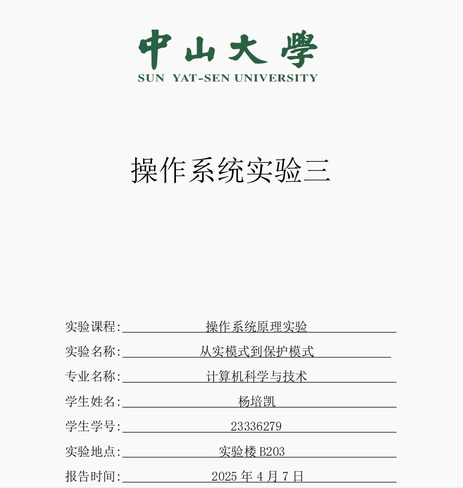

### Section1 实验概述

- **实验任务一**：使用`MBR`加载`bootloader`到内存中，并运行`bootloader`的代码
- **实验任务二**：在`bootloader`中进入保护模式，并结合`gdb`调试来分析进入保护模式的四个重要步骤
- **实验任务三**：在保护模式中运行字符回旋程序

### Section 2 实验步骤与实验结果

<style>
  .custom-hr {
    text-align: center;
    border-top: 1px solid #333;
    line-height: 0.1em;
    margin: 10px 0;
  }
  .custom-hr span {
    background: #fff;
    padding: 0 10px;
  }
</style>

<div class="custom-hr">
  <span>实验任务一</span>
</div>

- **任务要求**

  - 在`MBR`中加载`bootloader`到内存中，并跳转到`bootloader`起始地址开始执行，在`qemu`显示屏输出`assignment1.1 : run bootloader`
  - 将LBA28读取硬盘的方式换成CHS读取,并使用`int 13h`中断把`bootloader`读入到内存中，并同样在`qemu`显示屏输出`assignment1.2 : run bootloader`

- **思路分析**

  - **任务1.1**
  
    - 在`MBR`中使用循环来调用五次`asm_read_hard_disk`函数把占据了五个扇区的`bootlaoder`读入到起始地址为`0x7e00`对应的空间中，每次读入一个扇区，然后跳转到`bootloader`在内存中的起始地址
    - 其中，`asm_read_hard_disk`函数采用的是`LBA28`硬盘读取方式，先把读命令写入到地址`0x1f3`~`0x1f7`对应的空间中，然后等待硬盘空闲，通过循环读入一个扇区的512个字节到内存中
    - 然后，从`0x7e00`开始运行`bootloader`,`qemu`显示屏上输出`assignment1.1 : run bootloader`
  
  - **任务1.2**

    - 相较于任务1.1，任务1.2主要是把硬盘读取方式变成`CHS`模式，其余操作同上。
    -  **LBA28->CHS**：`C`、`H`、`S`分别代表柱面号、磁头号、扇区号， 对应的空间大小关系是：柱面 > 磁头 > 扇区。因此当扇区数量等于每磁头扇区数时，这些扇区就能组成一个磁头；当磁头数量等于每柱面磁头数时，这些磁头就能组成一个柱面。而`LBA28`硬盘读取方式恰好给出的就是逻辑扇区号(通俗理解就是把柱面和磁头拆成扇区大小，按顺序排成线性队列，然后某个扇区在队列中的序列号就是逻辑扇区号)，因此我们通过把扇区号进行除法和取余就能得到`CHS`模式下对应的柱面号、磁头号、扇区号。
    - `CHS`硬盘读取模式需要使用`int 13h`中断，而且能够一次性读入指定数量的扇区，不用把读命令写入指定地址，也不需要多次循环，代码编写简单。

      ```nasm
      ; 使用 int 13h 磁盘读取中断，来一次性把逻辑扇区 1 ～ 4 放入到0x0000 : 0x7e00
      mov ah, 02h      	; 功能号
      mov al, 4        	; 一次性读入的扇区数
      mov ch, 0        	; 柱面号
      mov cl, 2        	; 扇区号
      mov dh, 0        	; 磁头号
      mov dl, 80h      	; 硬盘号
      int 13h          	; 中断
      ```

- **实验步骤**

  - 编写`mbr`代码并编译放入0号扇区

    ```nasm
    gedit mbr.asm
    nasm -f bin mbr.asm -o mbr.bin
    dd if=mbr.bin of=hd.img bs=512 count=1 seek=0 conv=notrunc
    ```

  - 编写`bootloader`代码编译并放入1号扇区

    ```nasm
    gedit bootloader.asm
    nasm -f bin bootloader.asm -o bootloader.bin
    dd if=bootloader.bin of=hd.img bs=512 count=5 seek=1 conv=notrunc
    ```
  
  - 运行`qemu`

    ```nasm
    qemu-system-i386 -hda hd.img -serial null -parallel stdio 
    ```

- **实验结果**

  - 任务1.1
  
    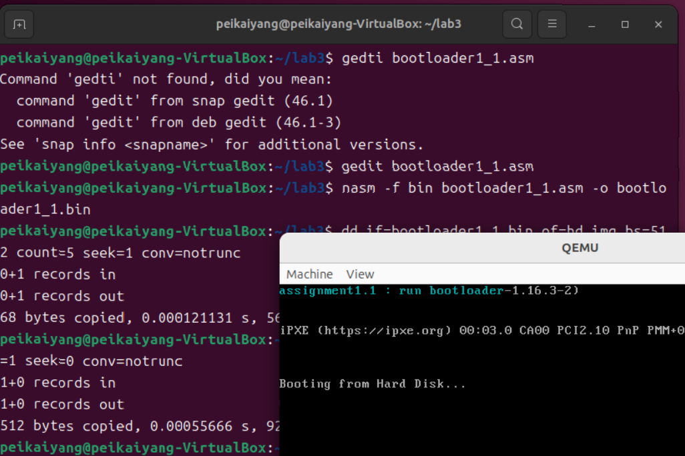
  
  - 任务1.2

    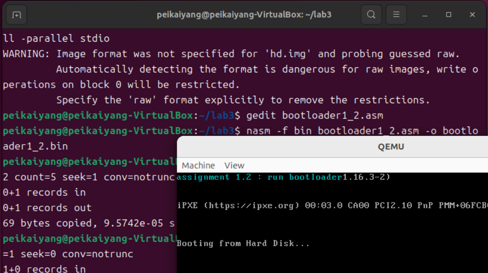

<style>
  .custom-hr {
    text-align: center;
    border-top: 1px solid #333;
    line-height: 0.1em;
    margin: 10px 0;
  }
  .custom-hr span {
    background: #fff;
    padding: 0 10px;
  }
</style>

<div class="custom-hr">
  <span>实验任务二</span>
</div>

- **任务要求**

  - 使用`gdb`调试来分析在进入保护模式过程中 `准备GDT`、`打开第二十一条地址线`、`开启cr0保护模式标志位`、`远跳转进入保护模式`四个步骤寄存器内容的变化情况

- **思路分析**

  - **准备GDT**
  
    - `GDT`的地址为`0x8800`，只需要查看 `GDTR`初始化 前后的`GDT`中的内容的变化情况即可
  
  - **打开第二十一条地址线**
  
    - 由于`in al, 0x92`，因此第二十一条地址线是否被打开，只需查看`or al, 0000_0010B`命令前后的`eax`内容的变化情况即可
  
  - **开启cr0保护模式标志位**
  
    - 由于`mov eax, cr0`，因此`PE`位是否被设置为1，只需要查看`or eax, 1`命令前后的`eax`内容的变化情况即可(但实际上，在使用`info registers`命令时，也可以直接查看`cr0`的值，因此直接查看`cr0`值的变化是更直接的做法)
  
  - **远跳转进入保护模式**
  
    - 在`bootloader`中是通过`jmp dword CODE_SELECTOR:protect_mode_begin`来进入保护模式的，因此，我们只需查看在这行代码前后的段寄存器`cs`、`ds`、`es`、`fs`、`gs`以及栈指针`eip`内容的变化情况即可

- **实验步骤**

  - 在`assignment`文件夹中使用`make build`编译相关文件，然后输入`make debug`做好`debug`环境准备

  - 在`gdb`中设置断点`break *0x7e00`，并输入`continue`运行到该断点
  
  - 然后，不断输入`stepi`，逐行运行`bootloader`的汇编代码

  - 在`准备GDT`、`打开第二十一条地址线`、`开启cr0保护模式标志位`、`远跳转进入保护模式`四个步骤运行前后，使用`info registers`来查看相应寄存器的内容

  - 最后，使用`coninue`运行剩下代码，在`qemu`显示屏输出`enter protect mode`

- **实验结果**

  - **准备GDT**

    - `GDTR`初始化前
    
      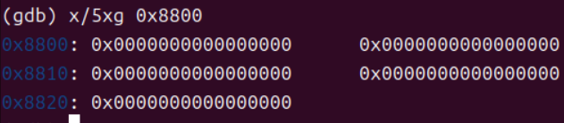
    
    - `GDTR`初始化后

      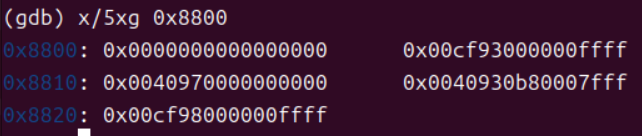

  - **打开第二十一条地址线**
  
    - **打开前**
    
      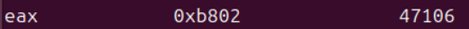
    
    - **打开后**
  
      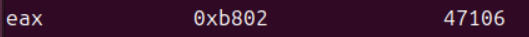

  
  - **开启cr0保护模式标志位**
  
    - **开启前**
    
      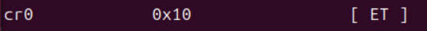
      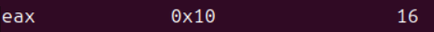
    
    - **开启后**
  
      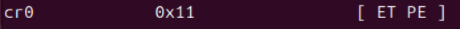
      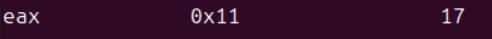
  
  - **远跳转进入保护模式**

    - **跳转前**
    
      
      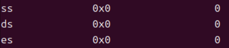
      
      
    
    - **跳转后**

      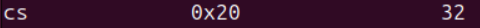
      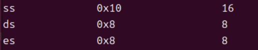
      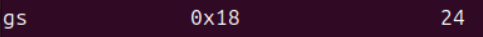
      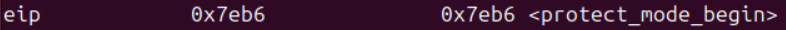
      

<style>
  .custom-hr {
    text-align: center;
    border-top: 1px solid #333;
    line-height: 0.1em;
    margin: 10px 0;
  }
  .custom-hr span {
    background: #fff;
    padding: 0 10px;
  }
</style>

<div class="custom-hr">
  <span>实验任务三</span>
</div>

- **任务要求**

  - 改写`lab2 assignment4`的字符回旋程序，使其能在保护模式下运行

- **思路分析**

  - 字符回旋程序在实模式和保护模式中的最大区别就是，在始陌始终可以使用中断来控制光标位置以及字符输出，但是在保护模式中，不能使用中断命令，因此就需要**直接操作显存**
  
  - 按照`assignment2`的方法进入保护模式
  
  - 先清空显示屏(这里使用的方法是全屏输出空字符' ')

    ```nasm
    ;清空屏幕
    Clear_screen:pusha                
    mov ecx, 80
    mov ebx, 25
    imul ecx, ebx
    mov ebx, 0
    mov ah, 0x07        
    mov al, ' '          
    Clear_loop:    mov [gs:ebx], ax   ;直接操作显存     
        add ebx, 2           
        loop Clear_loop     
    popa                 
    ret
    ```

  - 然后，在显示屏中央输出个人信息`ypk 23336279`。由于不需要使用中断一个字符一个字符的输出，我们可以按照输出字符串的方式来输出
  
    ```nasm
    ; 计算光标输出的初始位置，即显存的(11,34)位置处
    mov ebx, 12
    mov ecx, 80
    imul ebx, ecx
    add ebx, 35
    mov ecx, 2
    imul ebx, ecx

    ; 在指定光标位置开始输出'ypk 23336279'
    mov ecx, private_information_end - private_information
    mov esi, private_information
    mov ah, 0x70
    output_private_information:    mov al, [esi]
        mov word [gs:ebx], ax  ; 直接操作显存
        add ebx, 2
        inc esi
        loop output_private_information
    ```
  
    ```nasm
    private_information db 'ypk 23336279'
    private_information_end:
    ```
  - 字符回旋程序的主要思路还是和`lab2 assignment4`一致，只是把其中中断实现的部分换成了对显存的直接操作(用`ebx`来表示偏移地址，`gs`表示显存段选择子)

    ```UML
      Loop_above -> Loop_right
          ↑             ↓
      Loop_left  <- Loop_below
      ```

    - **自左向右**
    
      `ebx`从0开始，每次增加2，自左向右遍历显示屏上边缘 
      
    ```nasm
    ;在屏幕上边缘 自左向右 输出字符
    Loop_above:	cmp ebx, 158
	    je Loop_right
	
	    ;输出 字符
	    mov word [gs:ebx], ax ;直接操作显存
	
	    ;修改 字符内容
	    call Change_char
	
	    ;把光标向右移动1位
	    add ebx, 2
	
	    ;控制背景色和前景色的改变
	    inc ah
	
	    ;控制字符输出速度
	    call Slow_down
	
	    jmp Loop_above
    ```

    - **自上到下**

      `ebx`从158开始，每次增加160，自上向下遍历显示屏右边缘

    ```nasm
    ;在屏幕右边缘  自上向下  输出字符
    Loop_right:	cmp ebx, 3998
	    je Loop_below
	
	    ;输出 字符
	    mov word [gs:ebx], ax ;直接操作显存
	
	    ;修改 字符内容
	    call Change_char
	
	    ;把光标向下移动1位
	    add ebx, 160

	    ;控制背景色和前景色的改变
	    inc ah
	
	    ;控制字符输出速度
	    call Slow_down
	
	    jmp Loop_right
    ```

    - **自右到左**

      `ebx`从3998开始，每次减小2，自右向左遍历显示屏下边缘

    ```nasm
    ;在屏幕下边缘  自右向左  输出字符
    Loop_below:	cmp ebx, 3840
	    je Loop_left
	
	    ;输出 字符
	    mov word [gs:ebx], ax ;直接操作显存
	
	    ;修改 字符内容
	    call Change_char
	
	    ;把光标向左移动1位
	    sub ebx, 2

    	;控制背景色和前景色的改变
	    inc ah
	
	    ;控制字符输出速度
	    call Slow_down
	
	    jmp Loop_below
    ```    

    - **自下到上**

      `ebx`从3840开始，每次减小160，自下向上遍历显示屏左边缘

    ```nasm
    ;在屏幕左边缘  自下向上 输出字符  
    Loop_left:	cmp ebx, 0
	    je Loop_above
	
	    ;输出 字符
	    mov word [gs:ebx], ax ;直接操作显存
	
	    ;修改 字符内容
	    call Change_char
	
	    ;把光标向上移动1位
	    sub ebx, 160

	    ;控制背景色和前景色的改变
	    inc ah
	
	    ;控制字符输出速度
	    call Slow_down
	
	    jmp Loop_left
    ```

- **实验步骤**

  - 编写`mbr`文件(这里直接使用`assignment1.1`的`mbr`文件)

  - 编写`bootloader`文件(把`lab2 assignment4`和`lab3 assignment2`的代码整合到一起，重写有关中断的部分即可)

  - 编译并放入虚拟硬盘，启动`qemu`显示结果

- **实验结果**

  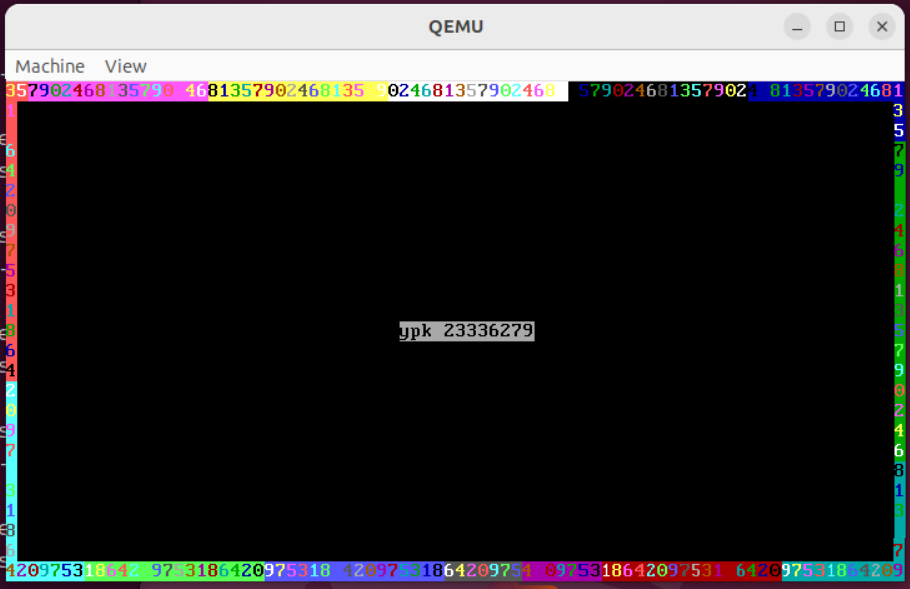

### Section 3 实验总结与心得体会

  - 前面两个任务在实验文档上都有详细指导，没有很大的复现难度

  - 在任务三中，其实`bootloader.asm`文件没有问题，问题恰恰是出在`mbr.asm`。我一开始使用的是`lab3 assignment1.2`的`mbr`文件，因为感觉使用`CHS`来读取硬盘的方式更简便。但是在打开`qemu`后，显示屏只是在快速闪烁，并没有输出程序中的内容。我以为是`bootloader`文件有问题，尝试改了很多地方，都没有任何改进。机缘巧合之下，我把`mbr`文件换成`lab3 assignment1.1`的`mbr`文件，然后就直接运行成功了。我觉得之所以是这样有些滑稽的解决方式，可能是因为`lab3 assignment1.2`的`mbr`文件还是有地方没考虑周全的，但是在`lab3 assignment1.2`的情况下，能够碰巧运行，就导致了在任务3的失败，所以`lab3 assignment1.2`的`mbr`文件，还需要去仔细检查，修改漏洞。

### Section 4 参考资料清单

[1] 课程实验文档：https://gitee.com/apshuang/sysu-2025-spring-operating-system/tree/master/lab3

[2] `deepseek`提供了一些`nasm`的语法支持，以及`assignment3`的思路(直接操作显存)也主要来源于`deepseek`