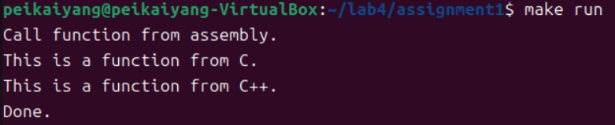
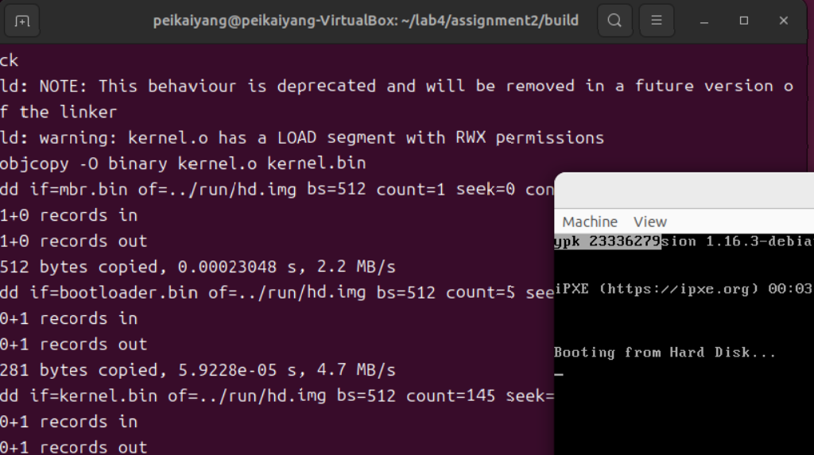
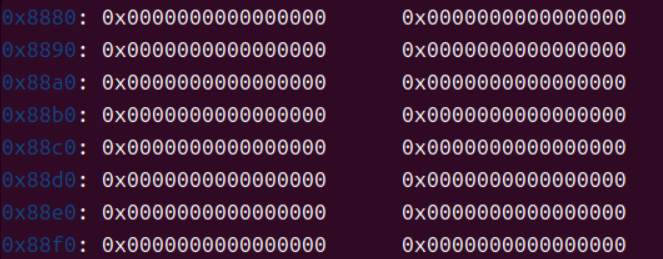
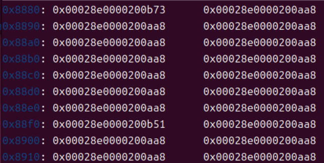
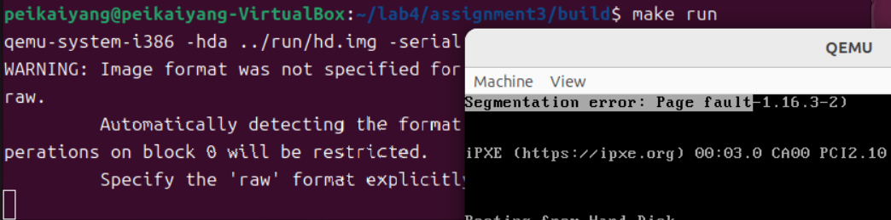
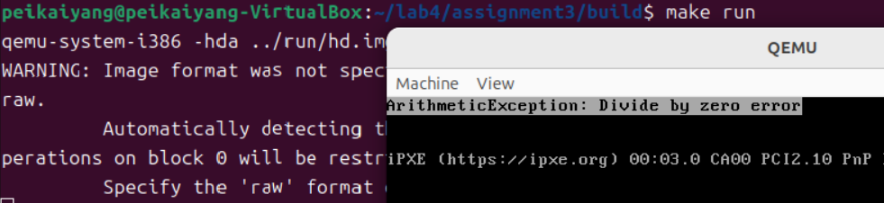
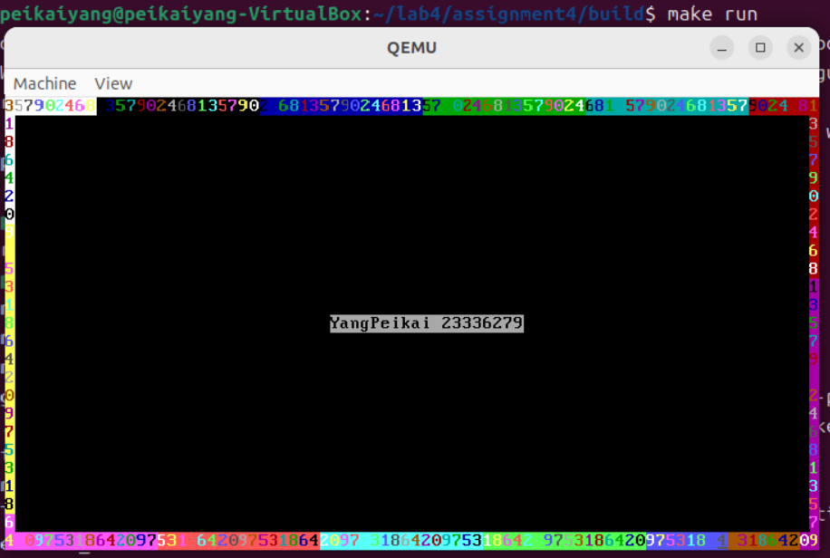

### Section1 实验概述

- **实验任务一**：实现C语言和汇编语言的混合编程，并使用`make`来完成混合程序的编译运行
- **实验任务二**：使用C/C++来编写内核，并使用`bootloader`把内核加载到内存中，启动内核运行
- **实验任务三**：初始化中断描述符表`IDT`，建立保护模式下的中断处理机制
- **实验任务四**：利用`8259A芯片`截获的周期时钟中断在`qemu`显示中断发生次数/字符回旋图

### Section 2 实验步骤与实验结果

<style>
  .custom-hr {
    text-align: center;
    border-top: 1px solid #333;
    line-height: 0.1em;
    margin: 10px 0;
  }
  .custom-hr span {
    background: #fff;
    padding: 0 10px;
  }
</style>

<div class="custom-hr">
  <span>实验任务一</span>
</div>

- **任务要求**

  - 在C代码中调用汇编函数，在汇编代码中调用C函数，最后使用`make`来完成程序的运行

- **思路分析**

  - 混合编程函数调用规则：
    - **汇编代码调用C函数**：在汇编代码中声明函数来自外部`extern + 函数名`(确保在链接阶段可以找到函数的实现)
    
      ```nasm
      extern function_from_C
      ```
    
    - **汇编代码调用C++函数**：在汇编代码中声明函数来自外部`extern + 函数名`，在C++函数返回值类型前加`extern "c"`(确保C++函数按照C函数的方式来调用) 
    
      ```nasm
      ; 在汇编代码中
      extern function_from_CPP
      ```

      ```c++
      # 在C++代码中
      extern "c" void function_from_CPP();
      ```

    - **C代码调用汇编函数**：在汇编代码的函数声明前加`global`，在C语言代码中声明函数来自外部`extern void + 函数名()` (确保在链接阶段可以找到函数的实现)
    
      ```nasm
      ; 在汇编代码中
      global function_from_asm
      ```

      ```c
      # 在C语言代码中
      extern void function_from_asm();
      ```

    
    - **C++代码调用汇编函数**：在汇编代码的函数声明前加`global`，在C语言代码中声明函数来自外部`extern "c" void + 函数名()` (确保在链接阶段可以找到函数的实现)

       ```nasm
      ; 在汇编代码中
      global function_from_asm
      ```

      ```c++
      # 在C++代码中
      extern "c" void function_from_asm();
      ```   

  - 在函数名前加`extern`、`global`是为了告诉编译器：该函数不在当前文件，要到别的文件找函数的实现。只不过C函数前是加`extern`，汇编函数前是加`global`。
  - 而在C++函数名前加`extern "c"`，则是因为C++函数可能存在重载，重载函数经过汇编得到的函数标签是不同的。因此，这里的`"c"`就是让编译器按照调用C函数的方式来调用，确保函数标签的唯一性。`extern`的用法同上。
    
- **实验步骤**

  - 编写相互调用函数的C、C++、汇编文件。特别注意根据文件类型以及调用类型给函数名加上`extern`、`global`、`extern "c"`(这里的代码文件与实验文档相同，不再赘述)

  - 编写`Makefile`
  
    ```makefile
    build:
        @g++ -m32 -c main.cpp -o main.o
        @nasm -f elf32 asm_utils.asm -o asm_utils.o
        @gcc -f -c c_func.c -o c_func_o
        @g++ -m32 -c cpp_func.cpp -o cpp_func.o
        @g++ -m32 main.o asm_utils.o c_func.o cpp_func.o -o main.out
    run:
        @./main.out
    clean:
        @rm -f *.o    
    ```

  - 在当前文件夹中依次输入以下命令

    ```nasm
    make build
    make clean
    make run
    ```

- **实验结果**

  

<style>
  .custom-hr {
    text-align: center;
    border-top: 1px solid #333;
    line-height: 0.1em;
    margin: 10px 0;
  }
  .custom-hr span {
    background: #fff;
    padding: 0 10px;
  }
</style>

<div class="custom-hr">
  <span>实验任务二</span>
</div>

- **任务要求**

  - 加载内核，并运行内核

- **思路分析**

  - **加载内核**：
  
    - 把`mbr`文件加载到内存`0x7c00`处，运行`mbr`从硬盘中读取`bootloader`
    - 把`bootloader`文件加载到内存`0x7e00`处，运行`bootloader`进入保护模式，并开始读取内核
    - 把内核加载到内存`0x20000`处，内核加载完毕后，可以启动并运行内核代码

  - 在`assignment2`中，`bootloader`加载完内核后，会执行跳转命令，跳转到地址`0x20000`开始运行内核代码。由于内核起始地址储存的是`enter_kernel`函数，因此在运行了`enter_kernel`函数后，会再次跳转到`setup_kernel`函数。所以，想要在`qemu`显示屏输出`ypk 23336279`，只需要修改`setup_kernel`函数中调用的`asm_hello_world`汇编函数即可。

  - 这里修改`asm_hello_world`函数的思路和`lab3 assignment3`是一样的——直接操作显存。助教已经给出了函数框架，只需把输出的字符替换即可。
  
- **实验步骤**

  - 下载实验文档中`src/5`文件夹到`lab4`文件夹中，修改`src/5`文件夹名称为`assignment2`
  - 修改`asm_hello_world`函数
  
    ```nasm
    cd assignment2/src/utils/
    gedit asm_utils.asm
    ```
  
  - 启动内核，编译并运行
  
    ```nasm
    cd ../../build
    make build && make clean && make run
    ```


- **实验结果**

  

<style>
  .custom-hr {
    text-align: center;
    border-top: 1px solid #333;
    line-height: 0.1em;
    margin: 10px 0;
  }
  .custom-hr span {
    background: #fff;
    padding: 0 10px;
  }
</style>

<div class="custom-hr">
  <span>实验任务三</span>
</div>

- **任务要求**

  - 初始化中断描述符表`IDT`，并给出 *除出错* 和 *页面错误* 两个中断处理函数的实现

- **思路分析**

  - 启动内核的第一步就是 **初始化中断描述符表`IDT`**,具体操作过程如下所示：
  
    - **把`IDT`的地址信息放入`IDTR`寄存器**。`IDTR`高32位储存`IDT`起始地址，低16位储存`IDT`界限。可以在汇编代码中调用`lidt`命令来实现。
    - **给出中断处理函数的使用实现**。中断处理函数需要实现以下功能：(1)保护CPU运行上下文、(2)处理中断、(3)恢复CPU运行环境，并返回。 
    - **初始化`IDT`中的*中断描述符***。一个*中断描述符*占用8个字节，储存了 中断处理函数所在段的段选择子、中断处理函数在段内的偏移地址、中断处理特权级等信息。

  - **保护模式下中断处理机制**如下：
  
    - CPU检测是否有中断信号
    - CPU把中断向量号作为索引，在`IDT`中找到相应的中断描述符。
    - CPU根据中断描述符中的段选择子，在`GDT`中找到相应的段描述符。
    - CPU根据中断描述符中的偏移地址和段描述符对应的段地址可以得到中断处理函数在内存中的地址。
    - CPU保护当前进程的上下文。
    - CPU跳转到中断处理函数在内存中的地址开始处理中断。
    - CPU恢复被中断进程的上下文。
    - 使用`iret`从中断处理函数返回
  
  - `setup.cpp`中已经给出了 *除零错误* 和 *页面错误* 两种故障，因此需要分别实现这两种故障的中断处理函数，并在`IDT`中完成中断描述符的注册。
  
    - **中断函数的实现**：
    
      - **页面错误**(在`qemu`第一行输出`Segmentation error: Page fault`)

        ```nasm
        ; 页面错误中断处理函数 -- 对应处理 setup.cpp 中的 *(int *)0x100000 = 1 中断  
        asm_page_fault_interrupt：
            pushad
            cli  ; 关中断

            mov ecx, page_fault_tag_end - page_fault_tag
            mov esi, page_fault_tag
            mov ebx, 0
            mov ah, 0x70
            output_page_fault_tag：
                mov al, byte [esi]
    	        mov word [gs:ebx], ax
    	        inc esi
    	        add ebx, 2
    	        loop output_page_fault_tag
    	
            popad
            jmp $
      
        page_fault_tag db 'Segmentation error: Page fault'
        page_fault_tag_end：
        ```

      - **除零错误**(在`qemu`第一行输出`ArithmeticException: Divide by zero error`)

        ```nasm
        ;  除数为零错误中断处理函数 -- 对应处理 setup.cpp 中的 1 / 0 中断
        asm_div_zero_fault_interrupt：
            pushad
            cli ; 关中断
            
            mov ecx, div_zero_fault_tag_end - div_zero_fault_tag
            mov esi, div_zero_fault_tag
            mov ebx, 0
            mov ah, 0x70
            output_div_zero_fault_tag：
    	        mov al, byte [esi]
    	        mov word [gs:ebx], ax
    	        inc esi
    	        add ebx, 2
    	        loop output_div_zero_fault_tag
    	
            popad
            jmp $
        
        div_zero_fault_tag db 'ArithmeticException: Divide by zero error'
        div_zero_fault_tag_end：
        ```

    - **注册中断描述符**
&nbsp;&nbsp;&nbsp;&nbsp;&nbsp;&nbsp;在查阅了实验文档之后，发现 *除出错* 和 *页面错误* 对应的中断向量号分别为 0 和 14，也就是说需要把中断处理函数`asm_div_zero_fault_interrupt`放在`IDT`中索引为0的位置，把中断处理函数`asm_page_fault_interrupt`放在`IDT`中索引为14的位置。(这样修改的结果就是，`IDT`中，除了索引为0和索引为14的中断描述符是不同的，其余的中断描述符均是相同的，指向的中断处理函数均是`asm_unhandled_interrupt`)

      ```c
      void InterruptManager::setInterruptDescriptor(uint32 index, uint32 address, byte DPL)
      {
          // 添加处理 页面错误  和 除出错 的函数
          if(index == 14) {address = (uint32)asm_page_fault_interrupt;}
          else if(index == 0) {address = (uint32)asm_div_zero_fault_interrupt;}
    
          IDT[index * 2] = (CODE_SELECTOR << 16) | (address & 0xffff);
          IDT[index * 2 + 1] = (address & 0xffff0000) | (0x1 << 15) | (DPL << 13) | (0xe << 8);
      }
      ```
      

- **实验步骤**

  - 下载实验文档中`src/6`文件夹到`lab4`文件夹下，改名为`assignment3`
  - 给出 *除出错* 和 *页面错误* 的中断处理函数

    ```nasm
    cd assignment3/src/utils
    gedit asm_utils.asm
    ```
  
  - 把 *除出错* 和 *页面错误* 的中断处理函数注册到`IDT`中

    ```nasm
    cd ../kernel
    gedit interrupt.cpp
    ```

  - 编译内核并运行

    ```nasm
    cd ../../build
    make build && make run  ; 如果是要查看IDT的内容的话，则是 make build && make debug
    ``` 

- **实验结果**

  - 内核初始化前后`IDT`的变化
  
    - 内核初始化前
    
      
    
    - 内核初始化后

      


  - `setup.cpp`中断处理结果

    - 页面错误

      

    - 除出错

      


<style>
  .custom-hr {
    text-align: center;
    border-top: 1px solid #333;
    line-height: 0.1em;
    margin: 10px 0;
  }
  .custom-hr span {
    background: #fff;
    padding: 0 10px;
  }
</style>

<div class="custom-hr">
  <span>实验任务四</span>
</div>

- **任务要求**

  - 使用`8259A`截获的周期时钟中断来实现字符回旋输出

- **思路分析**

  - **`8259A`芯片**：
  
    - `8259A`是一个接收中断请求的外设。在`assignment4`中用来截获`8253`芯片按照一定频率产生的时钟中断。
    - `8259A`的初始化需要严格按照顺序在主片和从片的特定端口输入*初始化命令字*ICW1~ICW4。
    - `8259A`芯片可以通过向特定的端口输入*操作指令字*OCW1~OCW3来优先级、中断屏蔽字以及EOI的动态改变。
  
  - 由于`8259A`已经提供了周期性的时钟中断，那么只需要把时钟中断的处理函数换成输出字符的函数即可，不再需要显式使用循环来实现字符的回旋。

    - 时钟中断处理函数只需完成以下三个功能：(1)确定下一个要输出的字符；(2)确定下一个要输出的字符的前景色和背景色；(3)确定下一个输出的位置。(`change_char`是额外加的函数，功能是确保输出的字符按照`1 3 5 7 9 0 2 4 6 8`的顺序改变，该函数的定义在`STDIO`类中 )

      ```c
      // 中断处理函数
      extern "C" void c_time_interrupt_handler()
      {
          // stdio.number 是用来记录 每次输出的数字
          // stdio.color 是用来记录 每次输出的字符的颜色
          // position  是用来记录当前光标位置的变量
          uint position = stdio.getCursor();
    
          // 每次调用时钟中断处理函数就输出一个字符
          stdio.print(stdio.number + '0',stdio.color);
    
          // 修改输出字符的 背景色 和 前景色
          stdio.color += 1;
          stdio.color %= 0xff;
    
          // 修改下一次要输出的字符
          stdio.change_char();
    
          // 修改下一次输出字符的光标位置
          // 如果要在上边缘输出字符
          if(position >= 0 && position < 79) {stdio.moveCursor(position + 1);}
          // 如果要在右边缘输出字符
          else if((position + 1) % 80 == 0 && position != 1999) {stdio.moveCursor(position + 80);}
          // 如果要在下边缘输出字符
          else if(position > 1920 && position <= 1999) {stdio.moveCursor(position - 1);}
          // 如果要在左边缘输出字符
          else if(position % 80 == 0 && position != 0) {stdio.moveCursor(position - 80);}
      }
      ```
      
  - 触发时钟中断是在`setup_kernel`函数中实现，也就是在`bootloader`加载完内核后，立即就触发时钟中断。(在`stdio.cpp`中我还额外加了`clear_screen`函数，用于在输出字符前清空屏幕。在`setup.cpp`中，我也调用了`STDIO`类中给出的`print`函数，用于在屏幕中央输出个人信息`YangPeikai 23336279`。但由于以上内容均不涉及本任务要求的时钟中断，故不详细介绍。)

    ```cpp
    extern "C" void setup_kernel()
    {
        // 中断处理部件
        interruptManager.initialize();
        // 屏幕IO处理部件
        stdio.initialize();
    
        // 清空屏幕
        stdio.clear_screen(); // 这个是我在STDIO类中新加的 用于清空屏幕的函数
    
        // 先在屏幕中央输出 姓名 + 学号，这里没有使用中断来实现，而是单纯调用函数来实现
        char information[] = "YangPeikai 23336279";
        stdio.moveCursor(12 * 80 + 32);  // 把光标移动到屏幕中央
        for(int y = 0;y < 19;y++)
        {
    	    stdio.print(information[y], 0x70);
    	    stdio.moveCursor(12 * 80 + 32 + y + 1);  // 把光标向前移动一格
        } 
        stdio.moveCursor(0);  // 把光标移回到（0,0）
    
        interruptManager.setTimeInterrupt((void *)asm_time_interrupt_handler); // 设置 处理时钟中断 的中断向量号
        asm_enable_interrupt(); // 开中断，允许对中断产生响应
        interruptManager.enableTimeInterrupt();  // 开启8259A主片时钟中断，能够捕捉8253芯片每隔一段时间产生的时钟中断
                                                 // 时钟中断不需要手动产生
    				                      	     // 操作系统在检测到有时钟中断时，会 自动调用 时钟中断处理函数
    
        asm_halt();
    }
    ```
    
- **实验步骤**

  - 下载实验文档中的`src/7`文件夹到`lab4`文件夹中，并修改名称为`assignment4`
  - 修改时钟中断处理函数的实现

    ```nasm
    cd assignment4/src/kernel/
    gedit interrupt.cpp
    ```

  - 在`STDIO`类中实现`change_char`和`clear_screen`函数

    ```nasm
    gedit stdio.cpp
    ```

  - 修改`setup.cpp`

    ```nasm
    gedit setup.cpp
    ``` 

  - 编译内核并运行

    ```nasm
    cd ../../build/
    make build && make run && make clean
    ```

- **实验结果**

  

### Section 3 实验总结与心得体会

  - 在`assignemnt1`中，我使用`make`来编译运行程序时，总是有几十行报错，我调整了`makefile`中命令的顺序也不行。就在我即将放弃使用`make`，转用命令行的方式来编译运行的时候，实验文档中的`makefile`给了我极大的灵感——我发现在**链接**这个语句中，实验文档使用的是`g++`，而我使用的是`gcc`。我尝试修改了这一点之后，果然没有问题了。在询问了`deepseek`后，得知原因是：源代码文件中有一些是C++文件，如果链接时使用`gcc`就会导致**C++标准库链接缺失**，因此必须使用`g++`或者`手动引入c++的标准库`

  - 在`assignment4`中，由于我没有运行实验文档上给出的样例(时钟中断处理函数的功能是计数时钟中断发生次数)，因此我没注意到`8259A`芯片会提供周期性的时钟中断，我在第一版代码中设计的是使用循环来多次触发时钟中断，在每次发生时钟中断时，操作系统就会调用中断处理函数的输出一个字符。后来经过助教提醒，以及请教了周宏杰同学之后，我才知道不需要人为触发时钟中断，`8259A`芯片已经提供了周期性时钟中断，而我们需要做的事情非常简单——只需要在时钟中断处理函数中确定下一次输出字符的内容、颜色、位置即可，其他事情都由助教提供的代码框架完成。
  
  - 本次实验是建立在已经进入保护模式的情况下，进一步学习(1)加载操作系统内核；(2)初始化操作系统(初始化中断描述符表)，并建立保护模式下的中断处理机制；(2)完整跟踪一遍中断处理过程等内容。

### Section 4 参考资料清单

  [1]实验指导文档：https://gitee.com/apshuang/sysu-2025-spring-operating-system/tree/master/lab4